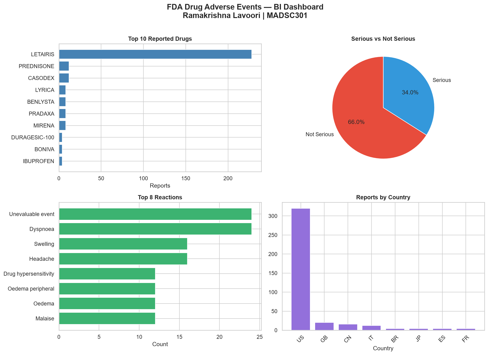
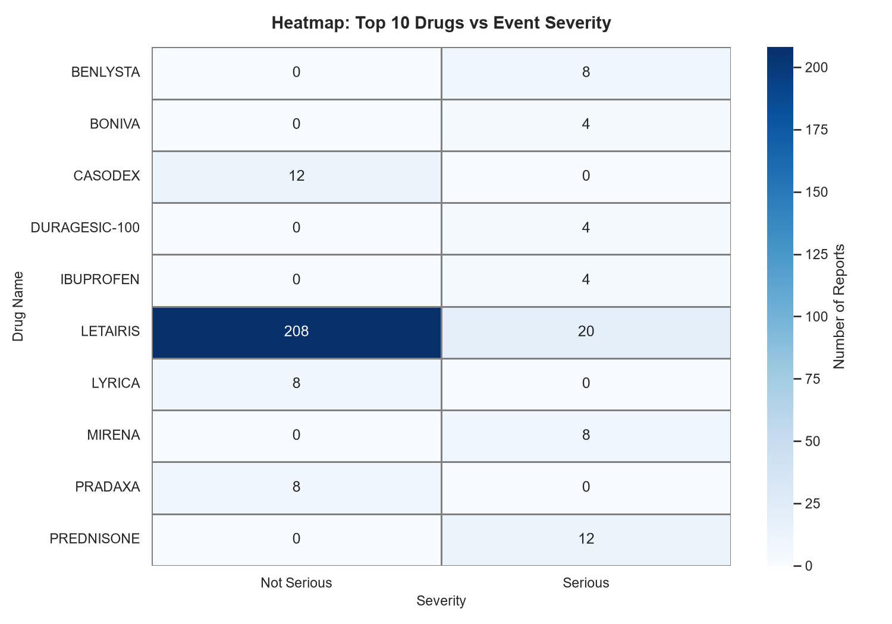
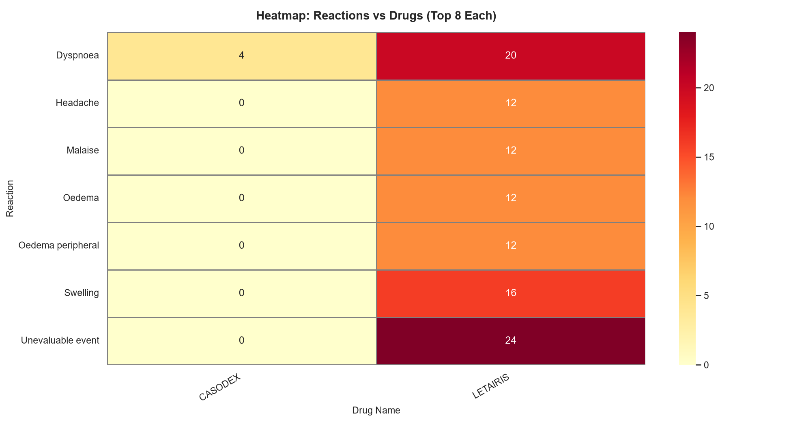
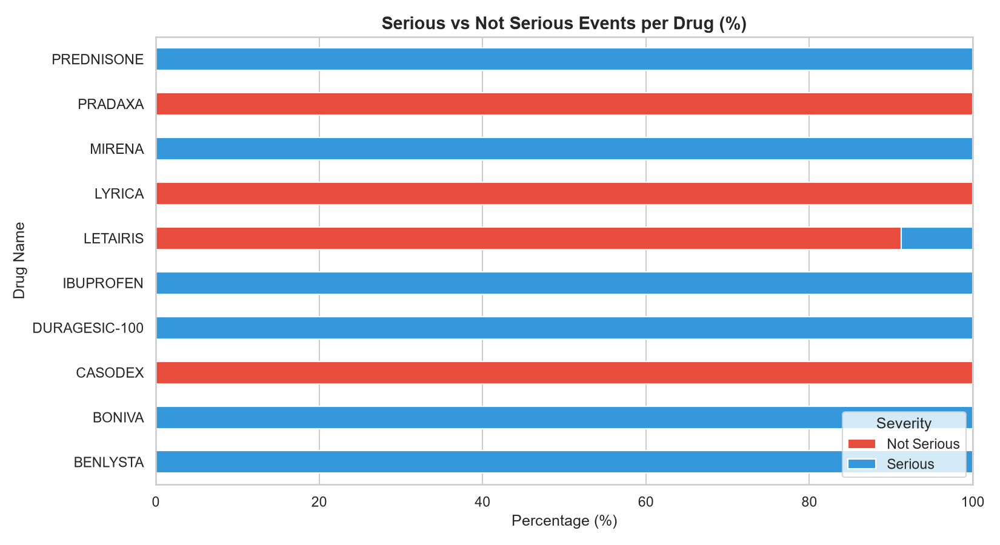

# FDA Drug Adverse Events — BI Pipeline


**Course:** MADSC301 — Business Intelligence  
**Student:** Ramakrishna Lavoori | **ID:** 25056894  
**Professor:** Dr. Zainab Usman | **Term:** 3 — AY 2025/26

---

## Business Case
Analyzing FDA adverse drug event reports to identify which drugs cause the most side effects — helping hospitals, pharmacies, and health regulators make safer decisions.

---

## Technology Stack

| Area | Technology |
|------|------------|
| Data source | OpenFDA API (free, no key required) |
| Programming language | Python 3.11 |
| Data cleaning | Pandas and NumPy |
| Development environment | Jupyter Notebook + VS Code |
| Database | PostgreSQL 18 |
| Database administration | pgAdmin 4 |
| Database connection | psycopg2 + SQLAlchemy |
| Orchestration | pipeline.py + Windows Task Scheduler (daily 08:00) |
| Visualisation | Matplotlib + Seaborn |
| Version control | Git and GitHub |

---

## Pipeline Architecture

OpenFDA API → collect.py → clean.py → PostgreSQL → visualize.py → Dashboard

↑

pipeline.py (orchestrator)

fda_pipeline/

├── data/

│   ├── raw/                    # Raw API data

│   └── processed/              # Cleaned data + charts

├── database/

│   ├── create_tables.sql       # Database schema

│   └── queries.sql             # Professional SQL queries

├── notebooks/

│   └── fda_analysis.ipynb      # Jupyter analysis notebook

├── reports/                    # CSV query results

├── screenshots/                # Dashboard screenshots

├── scripts/

│   ├── collect.py              # Fetch data from OpenFDA API

│   ├── clean.py                # Clean and transform data

│   ├── load.py                 # Load into PostgreSQL

│   ├── visualize.py            # Basic charts

│   ├── advanced_viz.py         # Heatmaps + advanced charts

│   ├── run_queries.py          # Run SQL queries

│   └── run_pipeline.bat        # Windows batch runner

├── pipeline.py                 # Orchestrates full ETL

├── requirements.txt            # All dependencies

├── .env                        # Credentials (not uploaded)

└── README.md

---

## Dashboard Results

| KPI | Result |
|-----|--------|
| Total records collected | 100 |
| Unique drugs | 89 |
| Unique reactions | 67 |
| Most reported drug | LETAIRIS (168 reports) |
| Most common reaction | Dyspnoea |
| Serious events | 34% |
| Not serious events | 66% |

---

## Screenshots

### Summary Dashboard


### Heatmap — Drug vs Severity


### Heatmap — Reactions vs Drugs


### Severity Breakdown per Drug


---

## Key Insights

1. LETAIRIS dominates with 168 adverse event reports — far above all others
2. 66% of events were Not Serious — but 34% Serious represents real patient harm
3. Dyspnoea is the most common reaction — needs urgent clinical attention
4. Many reports lack country data — global reporting gap exists
5. PREDNISONE, RANOLAZINE and BENLYSTA had 100% serious event rates

---

## Recommendations

1. Health regulators should closely monitor LETAIRIS prescriptions
2. Dyspnoea as top reaction warrants urgent clinical attention
3. Improve global reporting systems to capture country data
4. Schedule daily pipeline runs to track new adverse events
5. Expand dataset to 1000+ records for deeper trend analysis

---

## Workflow Scheduling

The pipeline is automated using **Windows Task Scheduler** to run daily at **08:00 AM**.

| Setting | Value |
|---------|-------|
| Task Name | FDA_BI_Pipeline |
| Schedule | Daily |
| Run Time | 08:00 AM |
| Script | scripts/run_pipeline.bat |
| Status | Ready |

To verify the scheduled task:
```bash
schtasks /query /tn "FDA_BI_Pipeline"
```

---

## How to Run

```bash
# 1. Clone the repo
git clone https://github.com/ramke830/fda-pipeline.git
cd fda_pipeline

# 2. Create virtual environment
python -m venv venv
venv\Scripts\activate

# 3. Install dependencies
pip install -r requirements.txt

# 4. Run full pipeline
python pipeline.py

# 5. Run advanced visualizations
python scripts/advanced_viz.py

# 6. Run SQL queries
python scripts/run_queries.py

# 7. Open Jupyter notebook
jupyter notebook notebooks/fda_analysis.ipynb
```

---

## Security
- Credentials stored in `.env` file
- `.env` and `venv/` excluded via `.gitignore`
- PostgreSQL password not included in repository

---

## Limitations
1. Dataset limited to 100 records per API call
2. Some reports lack country information
3. Drug names may have spelling variations
4. API results may change between extraction times

---

## Future Improvements
- Collect 1000+ records for deeper analysis
- Add machine learning for reaction prediction
- Docker containerisation
- Email notifications for pipeline failures
- Cloud database deployment

---

## Author
**Ramakrishna Lavoori**  
Business Intelligence Final Assignment — MADSC301  
EU Business School Munich — Spring Semester 2026  
GitHub: [ramke830](https://github.com/ramke830)
